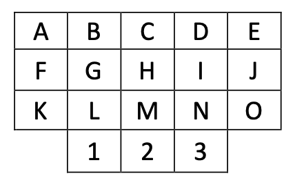

# find-my-number



Given the above keypad find all 10 key sequences that can be keyed in given the following
constraints:

1. The initial keypress can be any key. --DONE
2. Each subsequent keypress must be a knight move from the previous key.
3. There can be at most 2 vowels in the sequence.

A knight move is defined as either of the following:

- Move two keys vertically and one horizontally.
- Move two keys horizontally and one vertically.

# Useage

Before running ensure you have uv installed (can be downloaded from the company store - but will need a S4 reboot)

## To initialise the project please run

```
uv sync
```

## To run please use

```
uv run main.py
```

## To run the python tests please use

```
uv run pytest --cov .
```

To run without uv please run the following commands (reccomended method is to create a virtual environment)

## Create and activate Virtual environment

```
python -m venv venv
venv/Scripts/activate
```

## install dependencies

```
pip install pytest
pip install pytest-cov
```

## run without uv please use

```
python main.py
```

## To run the python tests without please use

```
pytest --cov .
```
